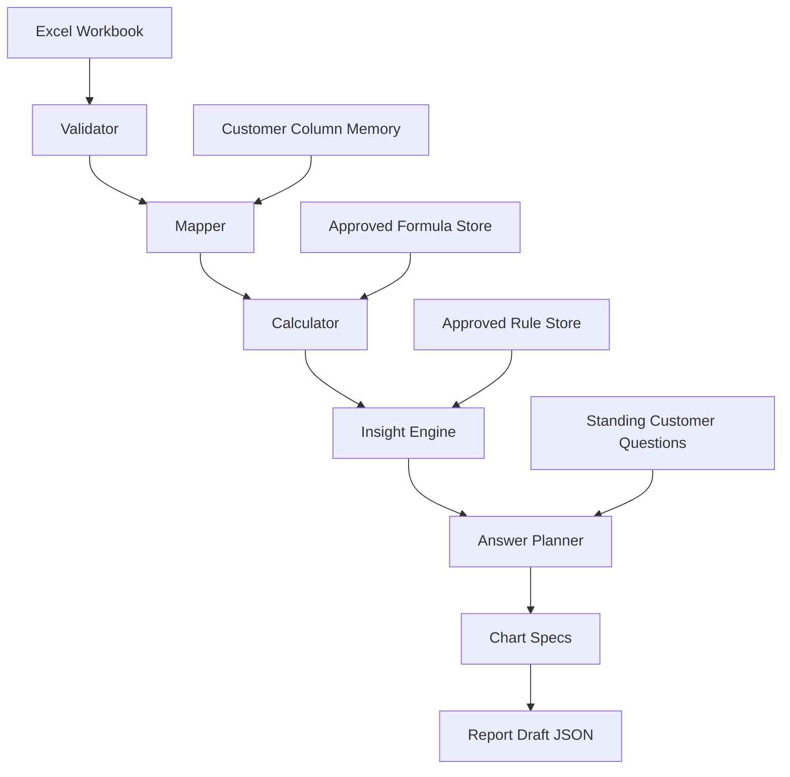
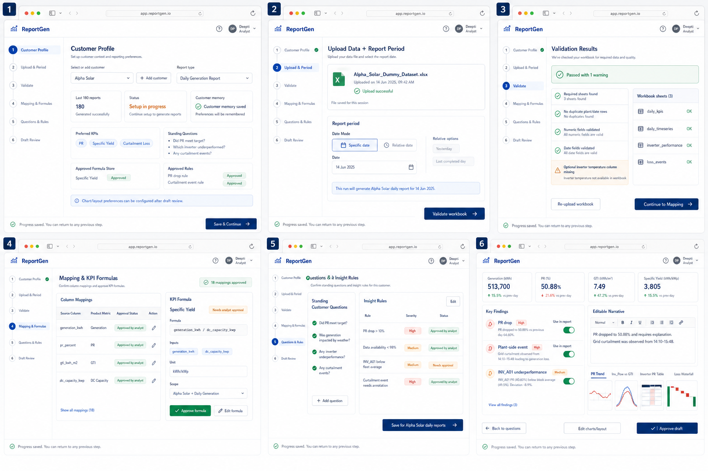

# ReportGen

ReportGen is a backend-first prototype for generating intelligent solar performance reports from analyst-prepared data.

The current MVP focuses on a daily solar generation report. It validates an uploaded workbook, maps customer columns, calculates KPIs, runs analyst-approved insight rules, plans answers to customer questions, prepares chart specs, and assembles a report draft JSON for a future frontend.

## Intended Users

ReportGen is intended for teams that repeatedly create operational performance reports from structured data, especially where customers expect report-specific explanations and client-specific thresholds.

Initial target users:

- renewable energy analytics teams
- solar and wind O&M companies
- asset managers
- performance reporting teams
- energy consultants
- data analysts who prepare recurring customer reports

The prototype starts with solar daily generation reporting, but the design is intentionally shaped so formulas, thresholds, questions, and report rules can become customer/report-type specific over time.

## Product Principle

ReportGen is designed around analyst control:

```text
Analyst defines and approves.
Python calculates and checks.
AI explains later.
The product remembers customer preferences.
```

KPI values are calculated by deterministic Python/pandas logic, not guessed by AI.

## Key Product Decisions

- Deterministic calculation before AI narration, to prevent AI from inventing or miscalculating KPI values.
- Analyst approval before automation, because customer-specific formulas and thresholds vary.
- Database-driven formulas and rules instead of hardcoded logic, so the product can adapt by customer and report type.
- Chart-ready JSON before frontend design, so the backend can support multiple future report layouts.
- Draft JSON before PDF export, so analysts can review and edit findings before final delivery.
- Uploaded files are treated as source inputs, while calculated report data and approved configuration become product memory.

## Current Backend Flow

```text
Excel workbook
-> validate workbook/data
-> map customer columns to standard names
-> calculate KPIs
-> run approved insight rules
-> load approved customer questions
-> build answer plan
-> generate chart specs
-> assemble report draft JSON
```



## Product Workflow Mockup

The prototype frontend is planned as a guided analyst workflow rather than a crowded all-in-one dashboard. Each step saves progress, and analysts can return to mapping, formulas, questions, or rules before approving a report draft.



The mockup covers:

- selecting or adding a customer and report type
- uploading data and choosing a report period
- reviewing validation results
- approving mappings and KPI formulas
- managing standing customer questions and insight rules
- reviewing editable narratives, findings, charts, and tables

## Current MVP Capabilities

The current MVP can:

- accept an uploaded Excel workbook through the API
- validate daily KPI workbook data
- confirm and apply customer column mappings
- calculate KPIs from approved formulas
- surface pending formula approvals when a KPI is missing
- store customer/report-specific formulas and insight rules
- run approved deterministic insight rules
- store standing customer questions for recurring reports
- plan which evidence components are needed to answer questions and findings
- generate chart-ready JSON specs
- generate deterministic, editable narrative blocks without an AI dependency
- assemble a frontend-ready report draft JSON
- test the full June 14 event-day flow end to end

### Core backend modules

- `backend/database.py` - SQLite tables and product memory for customers, mappings, formulas, insight rules, standing questions, and report history basics.
- `backend/validator.py` - workbook and data quality checks.
- `backend/mapper.py` - customer column mapping to standard system names.
- `backend/calculator.py` - profile-driven KPI calculation.
- `backend/formula_utils.py` - safe formula validation.
- `backend/formula_service.py` - approve suggested formulas or save analyst-defined formulas.
- `backend/insights.py` - deterministic insight-rule execution.
- `backend/answer_planner.py` - decides what evidence is needed to answer standing questions and triggered insights.
- `backend/charts.py` - creates chart-ready JSON specs.
- `backend/narrator.py` - creates deterministic, editable narrative blocks from approved report evidence.
- `backend/report_draft.py` - assembles one frontend-ready report draft object.
- `backend/models.py` - Pydantic request/response models.
- `backend/storage.py` - upload file storage using `file_id`.
- `backend/main.py` - FastAPI app with MVP endpoints.

### API endpoints

The MVP API exposes only these endpoints:

```text
POST /upload
POST /validate
POST /calculate
GET  /profile/{customer_id}/{report_type}
GET  /customers
POST /approve/formula
POST /approve/insight-rule
```

## Example Event-Day Output

The end-to-end test uses the dummy Alpha Solar workbook for the June 14 event day.

Expected output:

```text
Validation: passed
Mapping: 18 columns confirmed
Calculation: PR 50.88%, generation 513,700 kWh, specific yield 3.805
Insights: 3 findings - PR drop (high), Plant-side event (high), INV_A01 underperformance (medium)
Answer plan: includes pr_trend_chart, inv_pow_gti_chart, inverter_pr_table, loss_waterfall
Chart specs: 4 specs generated
Report draft: draft_ready, 3 findings, 3 charts, 1 tables
```

## Project Structure

```text
reportgen/
├── backend/
│   ├── answer_planner.py
│   ├── calculator.py
│   ├── charts.py
│   ├── database.py
│   ├── formula_service.py
│   ├── formula_utils.py
│   ├── insights.py
│   ├── main.py
│   ├── mapper.py
│   ├── models.py
│   ├── narrator.py
│   ├── report_draft.py
│   ├── requirements.txt
│   ├── storage.py
│   └── validator.py
├── data/
│   └── Alpha_Solar_Dummy_Dataset.xlsx
├── tests/
└── outputs/
```

## Setup

Create and activate a virtual environment:

```bash
python -m venv .venv
source .venv/bin/activate
```

Install dependencies:

```bash
pip install -r backend/requirements.txt
```

Initialize the local SQLite database:

```bash
python backend/database.py
```

Confirm the Alpha Solar dummy mappings:

```bash
python backend/mapper.py
```

## Run Tests

Run the full backend test suite:

```bash
PYTHONDONTWRITEBYTECODE=1 pytest -p no:cacheprovider tests
```

Current verified status:

```text
38 passed, 2 warnings
```

The warnings are expected:

- a pandas warning from an intentional bad-numeric validator test
- a FastAPI/Starlette TestClient dependency deprecation warning

Run the event-day pipeline test with visible output:

```bash
PYTHONDONTWRITEBYTECODE=1 pytest -s -p no:cacheprovider tests/test_event_day_end_to_end.py
```

## Run the API

Start the FastAPI server:

```bash
uvicorn backend.main:app --reload
```

Open the API docs:

```text
http://127.0.0.1:8000/docs
```

## Current Scope

Built for the prototype:

- One Excel workbook
- Multiple sheets
- One report type: `daily_generation`
- One dummy customer: `alpha_solar`
- Deterministic backend only
- Analyst-approved formulas and insight rules
- Chart-ready JSON, not final rendered report pages

Not built yet:

- frontend UI
- PDF/export flow
- visual template editor
- Claude narration
- agent orchestration
- BigQuery/multi-source joins
- scheduling/email delivery
- long-term normalized data warehouse

## Design Direction

ReportGen is not intended to be "AI automatically generates reports."

The intended positioning is:

```text
AI helps analysts produce better client-specific reports faster,
with traceable calculations and review control.
```

The long-term vision is a configurable reporting advisor where analysts define:

- customer-specific metrics
- formulas
- thresholds
- standing customer questions
- insight rules
- report templates

The system then calculates, checks, explains, and drafts reports for analyst review.

## What This Demonstrates

This project demonstrates:

- product workflow design for analyst-facing systems
- deterministic KPI calculation and validation
- human-in-the-loop AI product thinking
- backend-first MVP scoping
- customer-specific product memory
- test-driven backend development with AI coding assistance
- a practical path from report quality checking toward intelligent report generation
